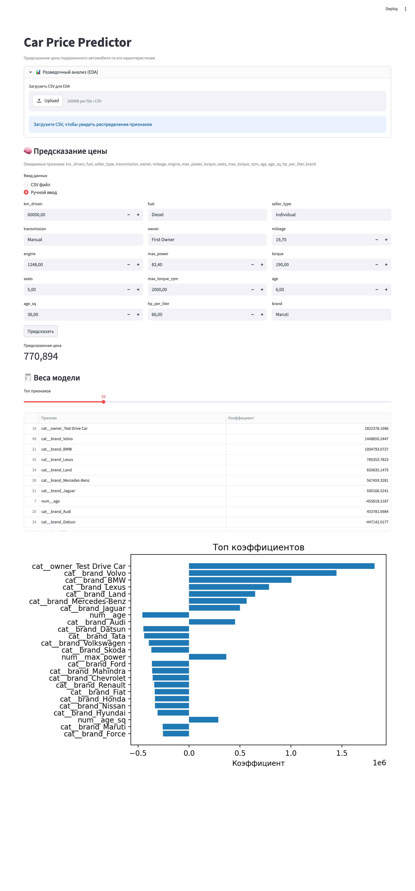

# Car Price Predictor

> 🇷🇺 Веб-сервис для оценки рыночной стоимости подержанных автомобилей  
> 🇬🇧 Web service that predicts the resale price of used cars

[](https://car-price-predictor-e4nravurdvevj7jrcyjpwf.streamlit.app)
[](https://www.python.org/)
[](https://scikit-learn.org/)

**Live demo:** <https://car-price-predictor-e4nravurdvevj7jrcyjpwf.streamlit.app>



---

## 🇷🇺 По-русски

### О проекте
End-to-end ML-проект: от EDA и обучения регрессионной модели до развёрнутого Streamlit-приложения. Пользователь либо вручную вводит характеристики автомобиля, либо загружает CSV — и получает предсказанную цену.

### Что внутри
- **EDA и feature engineering** в Jupyter-ноутбуке: разбор пропусков и дубликатов, парсинг строковых признаков (`mileage`, `engine`, `max_power`, `torque` → числа), приведение типов, корреляционный анализ (Pearson / Spearman / phik).
- **Подбор модели**: сравнивались `LinearRegression`, `Lasso`, `ElasticNet`, `Ridge` с GridSearchCV (10-fold CV).
- **Финальный пайплайн** — `sklearn.Pipeline`: `ColumnTransformer` (StandardScaler для числовых + OneHotEncoder для категориальных) → `Ridge(α≈2.59)`. Сериализован в `model_pipeline.pkl`.
- **Streamlit-приложение** (`app.py`): EDA по загруженному CSV, инференс по CSV или ручному вводу, визуализация коэффициентов модели.

### Метрики (hold-out test)
| Модель | R² test | MSE test |
|---|---|---|
| LinearRegression (только числовые) | 0.597 | 2.32 · 10¹¹ |
| Ridge + категории | 0.684 | 1.82 · 10¹¹ |
| **Ridge + категории + feature engineering** | **0.783** | **1.25 · 10¹¹** |

Feature engineering, который дал заметный прирост:
- `age = current_year − year`, `age_sq = age²` (нелинейная зависимость цены от возраста);
- `hp_per_liter = max_power / (engine / 1000)` (удельная мощность как прокси на класс авто);
- `brand` извлечён из `name` как отдельный категориальный признак.

### Запуск локально
```bash
git clone https://github.com/stepanpankratov/car-price-predictor.git
cd car-price-predictor

python -m venv .venv
source .venv/bin/activate          # Windows: .venv\Scripts\activate

pip install -r requirements.txt
streamlit run app.py
```

### Воспроизводимое обучение
```bash
python train.py        # скачает датасет, обучит пайплайн, перезапишет model_pipeline.pkl
```

### Структура проекта
```
.
├── app.py                  — Streamlit UI (EDA + инференс + визуализация весов)
├── train.py                — воспроизводимое обучение модели
├── model_pipeline.pkl      — сохранённый пайплайн (preprocess + Ridge)
├── requirements.txt
├── REPORT.md               — отчёт: метрики, выводы, что не получилось
├── docs/screenshot.png
└── notebooks/
    └── car_price_eda_modeling.ipynb   — EDA и эксперименты
```

### Стек
Python · pandas · numpy · scikit-learn · matplotlib · seaborn · Streamlit

### Данные
Датасет — публичная подборка объявлений о продаже б/у автомобилей: <https://github.com/Murcha1990/MLDS_ML_2022/tree/main/Hometasks/HT1>

### Ограничения
- Линейная модель → большие ошибки на хвостах распределения (премиум / редкие модели).
- Колонка `name` использована частично (только марка), модель не видит конкретную модификацию.
- Цена в индийских рупиях — для других рынков потребуется переобучение.

---

## 🇬🇧 In English

### About
End-to-end ML project: EDA, regression model training, and a deployed Streamlit app. Users can either fill car features manually or upload a CSV to get predicted prices.

### What's inside
- **EDA & feature engineering** in a Jupyter notebook: missing values & duplicates, parsing string columns (`mileage`, `engine`, `max_power`, `torque`) into numerics, type coercion, Pearson / Spearman / phik correlations.
- **Model selection**: `LinearRegression`, `Lasso`, `ElasticNet`, `Ridge` compared with GridSearchCV (10-fold CV).
- **Final pipeline** — `sklearn.Pipeline`: `ColumnTransformer` (StandardScaler for numerics + OneHotEncoder for categoricals) → `Ridge(α≈2.59)`. Serialized to `model_pipeline.pkl`.
- **Streamlit app** (`app.py`): EDA on uploaded CSV, inference via CSV or manual form, model coefficient visualization.

### Metrics (hold-out test)
| Model | R² test | MSE test |
|---|---|---|
| LinearRegression (numerics only) | 0.597 | 2.32 · 10¹¹ |
| Ridge + categoricals | 0.684 | 1.82 · 10¹¹ |
| **Ridge + categoricals + feature engineering** | **0.783** | **1.25 · 10¹¹** |

Feature engineering that moved the needle:
- `age = current_year − year`, `age_sq = age²` (non-linear price/age dependency);
- `hp_per_liter = max_power / (engine / 1000)` (specific power as a proxy for car class);
- `brand` extracted from `name` as a separate categorical feature.

### Run locally
```bash
git clone https://github.com/stepanpankratov/car-price-predictor.git
cd car-price-predictor

python -m venv .venv
source .venv/bin/activate          # Windows: .venv\Scripts\activate

pip install -r requirements.txt
streamlit run app.py
```

### Reproducible training
```bash
python train.py        # downloads data, fits pipeline, overwrites model_pipeline.pkl
```

### Stack
Python · pandas · numpy · scikit-learn · matplotlib · seaborn · Streamlit

### Data
Public used-car listings dataset: <https://github.com/Murcha1990/MLDS_ML_2022/tree/main/Hometasks/HT1>

### Limitations
- Linear model → large errors on the tails (premium / rare models).
- The `name` column is used only at brand level; the model doesn't see exact trim.
- Prices are in INR — other markets would require retraining.
